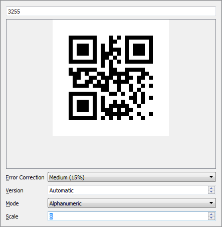

QR Encoder
====

A very simple GUI to generate [QR codes].

The application is self-explaining, you just need to enter the text to encode in a QR code and the corresponding image will be shown under it. It is also possible to manually set few parameters.

[QR Codes]: https://en.wikipedia.org/wiki/QR_code
